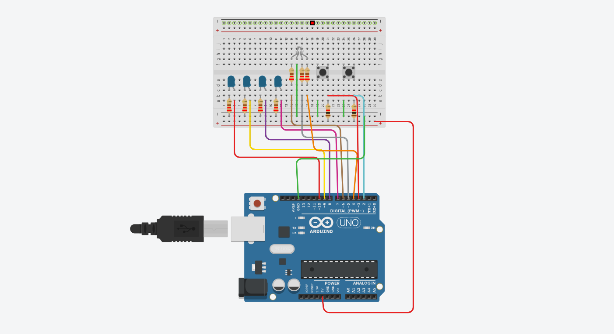
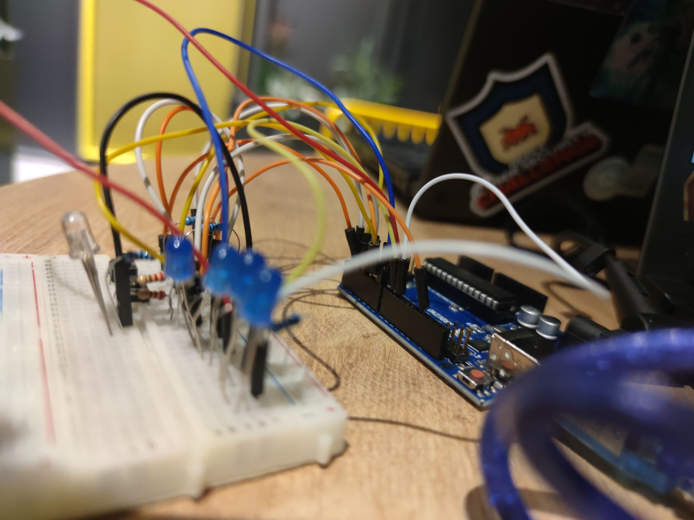
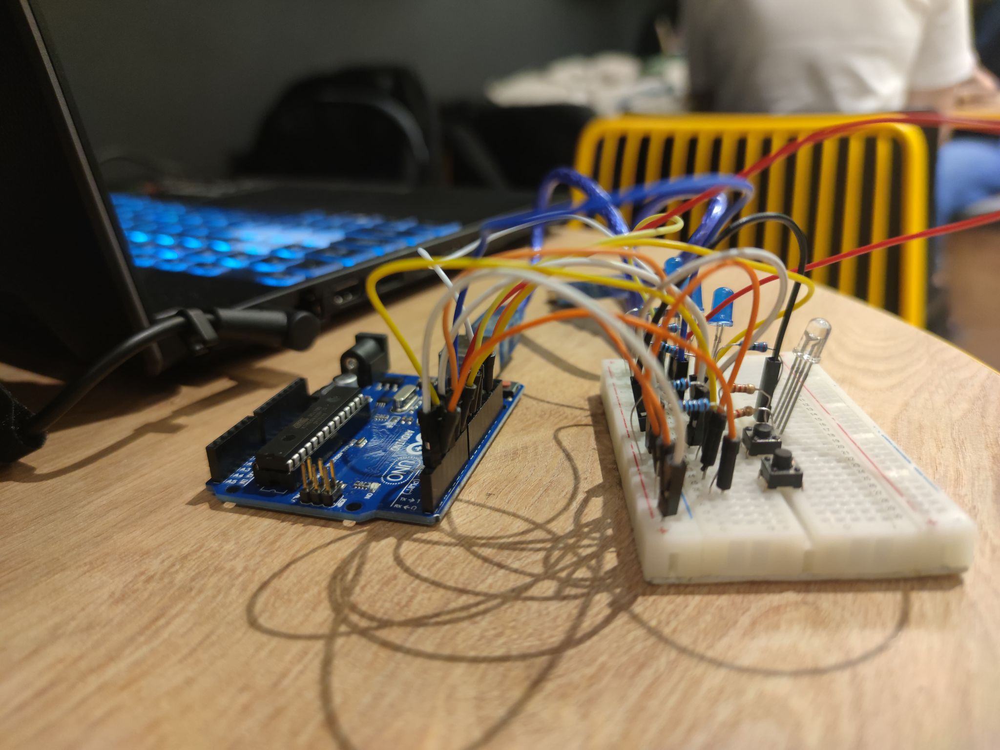
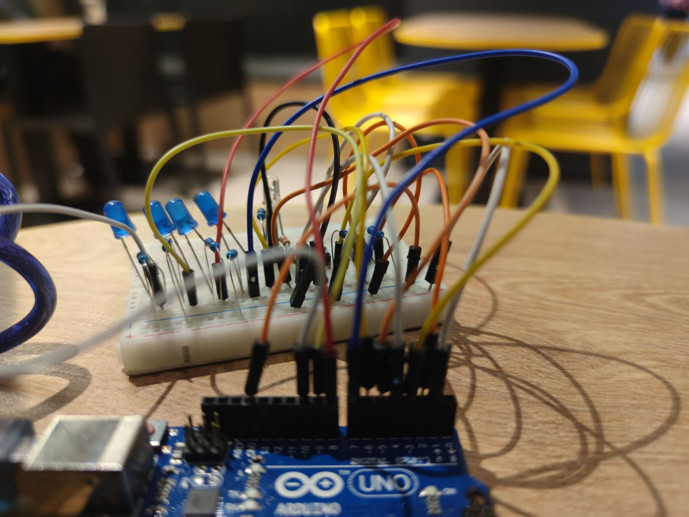
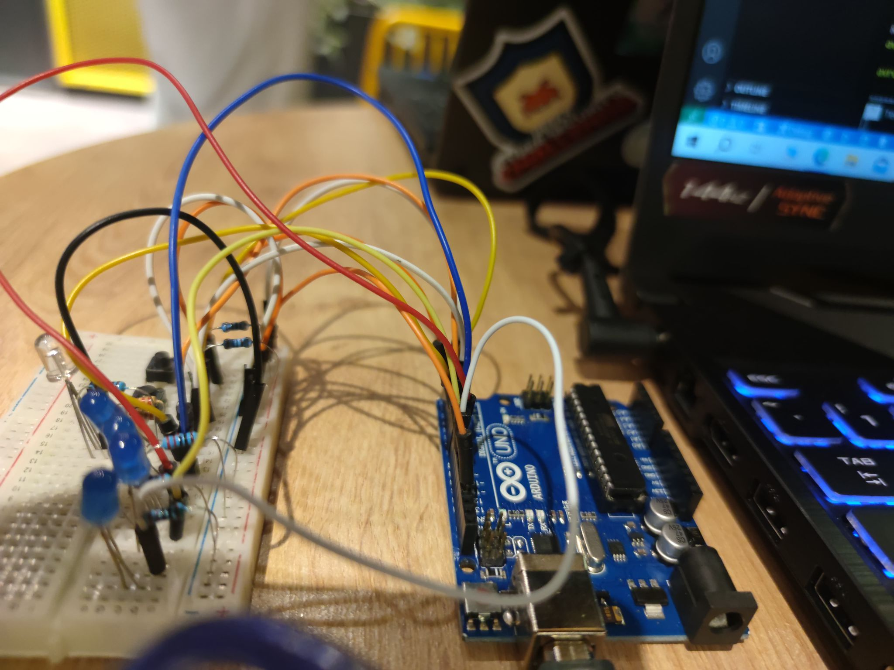

# IntroRobotica---EV-Charger

# Electric Vehicle Charging Station Simulation

## Task Description
This project simulates a basic electric vehicle charging station using an Arduino Uno, LEDs, and buttons. The system alternates between two main states:

- **Available**: The station is free, and the RGB LED indicates this with a green light.
- **Charging**: The station starts charging a vehicle, where the RGB LED turns red, and the four progress LEDs represent the charging level (from 25% to 100%).

## Functional Overview

### RGB LED: Shows the station's availability:
- **Green**: Station is free (not charging).
- **Red**: Station is charging a vehicle.

### 4 Progress LEDs: Simulate the percentage of charging:
- **L1** (25%)
- **L2** (50%)
- **L3** (75%)
- **L4** (100%)

### Buttons:
- **Start Button**: A single press initiates the charging process if the station is available.
- **Stop Button**: Pressing and holding for at least 1 second stops the charging process.

## Charging Process
1. When charging starts, the RGB LED changes to red.
2. The first progress LED (L1) blinks for 3 seconds (representing 25% charge), and then stays on.
3. The next LED (L2) blinks for 3 seconds, representing 50%, and this continues for L3 and L4 (up to 100%).
4. Once charging is complete, all LEDs blink 3 times to signal the end of the process.
5. If the stop button is held during charging, the process halts, and the RGB LED turns green.

## Components
- **Arduino Uno**
- **1x RGB LED** (for indicating station status)
- **4x LEDs** (for simulating charging progress)
- **2x Pushbuttons** (Start and Stop)
- **6x 220Ω Resistors** (for current limiting)
- **2x 1kΩ Resistors** (for button pull-downs)
- **Breadboard**
- **Jumper wires**

## Wiring Diagram

## Pin Assignments
- **RGB LED:**
  - Red: Pin 6
  - Green: Pin 4
  - Blue: Pin 5
- **Progress LEDs:**
  - L1 (25%): Pin 10
  - L2 (50%): Pin 9
  - L3 (75%): Pin 8
  - L4 (100%): Pin 7
- **Start Button**: Pin 3
- **Stop Button**: Pin 2

## Assembly Photos

## Video Demonstration

[Start Button Video Demonstration](https://youtu.be/qE5U2V8zHOs)
[Stop Button Video Demonstration]([https://youtu.be/qE5U2V8zHOs](https://youtu.be/PNKp6y91FdA))

## How to Use
1. Set up the circuit as per the wiring diagram.
2. Upload the provided Arduino code to your Arduino Uno.
3. Press the Start Button to initiate charging.
4. Watch the progress LEDs simulate the charging levels.
5. Hold the Stop Button for at least 1 second to interrupt the charging process.
